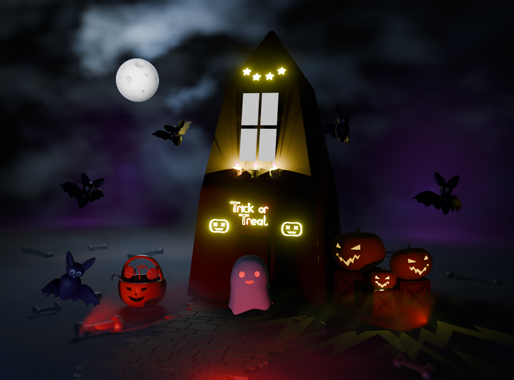
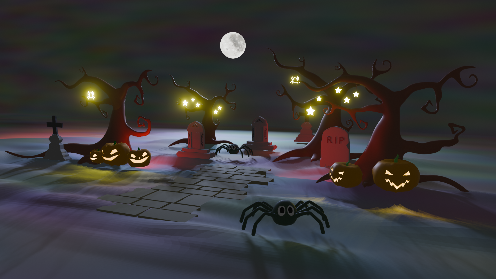

# Blender Assets for Halloween!!

<table>
  <tr>
    <td>
      
    </td>
    <td>
      
    </td>
  </tr>
</table>

There are 22 different 3D assets in the Blender files, along with 2 animated scenes to demonstrate how they can be used. These assets can be utilized for games or other purposes.

Bats

https://github.com/user-attachments/assets/207bf87f-3173-40b1-a580-c2ed410c995a

Candy & Basket

https://github.com/user-attachments/assets/cdb1a85a-c7ec-4858-94c4-4b6878b79f87

Crate

https://github.com/user-attachments/assets/4bd2db99-5af9-4b5e-b683-0e078a43ab25

FullMoon

https://github.com/user-attachments/assets/3229feff-10fe-4255-a0c4-94e161168394

Ghost

https://github.com/user-attachments/assets/49e62453-0b0c-448c-840f-a15549a88b3a

Pumpkin

https://github.com/user-attachments/assets/c954fa9d-9319-4f48-b768-487e0d3dcc02

